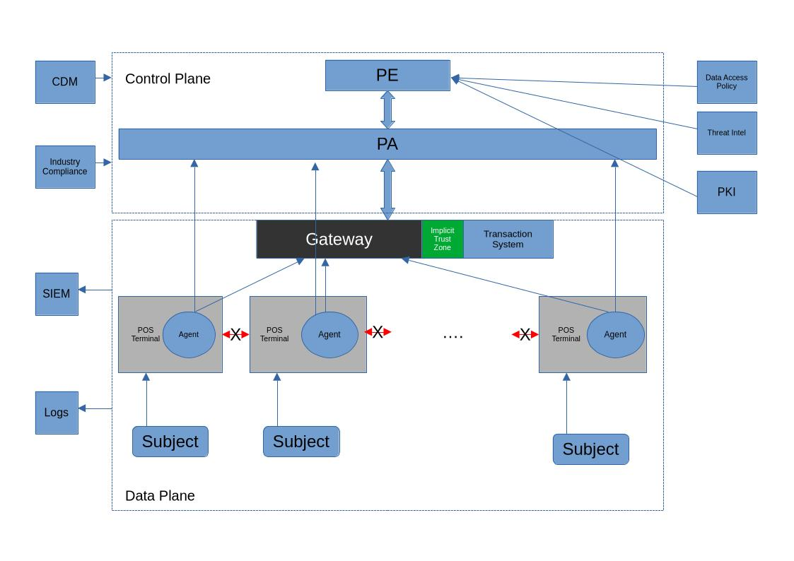

# امن سازی پایانه های فروش (POS) فروشگاه های زنجیره ای با معماری ZTA

معماری اعتماد صفر (ZTA) یک راهکار امنیت سایبری است که تمرکز خود را از دفاع در لبه شبکه (فایروال‌های سنتی) به حفاظت مستقیم از منابع (کاربران، دارایی‌ها و داده‌ها) منتقل می‌کند.

اجزای منطقی اصلی ZTA:

- موتور سیاست‌گذاری (PE): مغز متفکر که تصمیم می‌گیرد آیا اجازه دسترسی داده شود یا خیر
- مدیر سیاست‌گذاری (PA): اجراکننده دستورات PE که مسیر ارتباطی را باز یا بسته می‌کند
- نقطه اجرای سیاست (PEP): دروازه‌ای که مستقیماً ارتباط بین سوژه و منبع را پایش و کنترل می‌کند
  - در اینجا PEP به سیستم Agent  / Gateway  تفکیک شده است

## صورت مسئله 

جلوگیری از تزریق بدافزار و سرقت اطلاعات از طریق ایزوله‌سازی کامل POSها و محدود کردن ارتباط آن‌ها فقط به سرور تراکنش

#### ۱. طراحی سطح بالا (High-Level Design - HLD)

در این طرح، از مدل عامل/دروازه (Device Agent/Gateway Model) استفاده می‌کنیم.

- روی هر دستگاه POS یک عامل (Agent) نصب می‌شود. -> Sandboxing
- یک دروازه منبع (Gateway) در مقابل سرور تراکنش قرار می‌گیرد.  -> DPI
- ارتباطات جانبی (East-West) بین POSها کاملاً مسدود می‌شود تا حرکت جانبی (Lateral Movement) بدافزار غیرممکن شود. -> Lateral Movement
- سیستم های SIEM و لاگ ها وارد الگوریتم PE می شوند برای تشخیص ناهنجاری

#### ۲. تعریف سیاست های فیلترینگ لایه اپلیکیشن (Policy Definition Application Layer)

1. ‍‍`IF Subject=POS_Terminal AND Posture=Healthy AND Protocol=POS_Payment_v2_API THEN Access=Allow`
2. `IF Subject=POS_Terminal AND Action=Scan_Network THEN Access=Deny AND Log_Alert` (جلوگیری از شناسایی شبکه توسط بدافزار)
3. `IF Subject=POS_Terminal AND Destination!=Transaction_Server_IP THEN Access=Block` (محدودسازی دقیق مقصد)
4. `IF Subject=POS_Terminal AND Location=Outside_Store_Geofence THEN Access=Revoke` (اگر دستگاه از محدوده فروشگاه خارج شد، دسترسی قطع شود) 
5. `IF Subject=POS_Terminal AND Behavior=Anomalous_Traffic_Volume THEN Access=Re-evaluate` (اگر حجم ترافیک غیرعادی بود، PE باید دسترسی را مجدداً بررسی کند)
6. `IF Subject=POS_Terminal AND Destination_URL != https://transactions.re.com/api/v1 THEN Access=Block`
7. `IF Subject=POS_Terminal AND Command=SYSTEM_SHUTDOWN THEN Access=Deny AND Trigger_Alert`
8. `IF Subject=POS_Terminal AND Payload_Encryption=Invalid THEN Access=Block`

#### ۳. تشخیص ناهنجاری ها (Anomaly Detection)

برای شناسایی ناهنجاری، موتور سیاست‌گذاری (PE) باید از یک الگوریتم اعتماد ضمیمه ای (Contextual TA) استفاده کند

آموزش CTA :  با استفاده از لاگ های فعالیت آموزش می بیند. مثال:  که به طور تقریبی یک تراکنش POS تقریبا ۱۰kb است و هر ۲-۵ دقیقه رخ می دهد.

1. عامل یا Agent روی پایانه های فروش،‌ Application Sandboxing انجام می دهند،‌ برای اینکه اطمینان حاصل شوند تنها اپلیکیشن ها / نرم افزار های تایید شده با شبکه می توانند تعامل بر قرار کنند و در محیط خود پایانه با حداقل دسترسی سیستمی قرار دارند
2. دروازه تعامل با سرور تراکنش عمل DPI یا بررسی عمیق پکت ها را انجام می دهد،‌ که اطمینان حاصل کنیم تنها درخواست های معتبر API تراکنشی استفاده شده اند
3. سیستم SIEM و لاگ های فعالیت به CTA داخل PE اطلاعات را ارسال می کنند تا کار تشخیص ناهنجاری انجام شود

#### ۴. مدل‌سازی تهدید (Threat Modeling)

- جلوگیری از حرکت جانبی: اگر یک POS به بدافزار آلوده شود، چون PEP اجازه هیچ ارتباطی به جز سرور تراکنش را نمی‌دهد، بدافزار نمی‌تواند به POSهای مجاور سرایت کند.
- پنهان‌سازی منابع: سرور تراکنش برای هیچ دستگاهی قابل رویت (Discoverable) نیست مگر اینکه ابتدا توسط PEP (Agent / Gateway) تایید هویت شده باشد. این کار جلوی حملات شناسایی و DoS را می‌گیرد.
- جلوگیری از ورود بد افزار:‌ چون Agent ما کار Sandboxing انجام می دهد حتی اگر بدافزار به سیستم عامل پایانه نفوذ کند نمی تواند دسترسی به شبکه یا پروسه های تراکنشی داشته باشد	

#### ۵. ابزارهای پیشنهادی برای پیاده‌سازی (Implementation Toolset)

1. Appgate SDP: یک راهکار تجاری برای ایجاد محیط نرم‌افزارمحور (SDP) که ارتباطات POS را کاملاً ایزوله می‌کند 
2.  Zscaler Private Access (ZPA): برای مدیریت دسترسی‌های ابری و محلی پایانه‌ها بدون نیاز به VPN سنتی 
3. قوانین IPTables (در لایه لینوکس POS) به همراه یک SIEM متن‌باز مانند ELK: برای مانیتورینگ دقیق و مسدودسازی ترافیک غیرمجاز در لایه عامل

